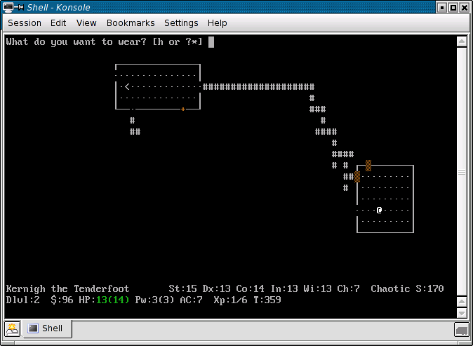

# Basic Markdown Syntax

This is a paragraph under the level one heading. Don't use more than one level one heading, because search enginges prioritize it. When using Pandoc you will not even need a level one heading because the `Title` is better placed in the meta-data property instead and rendered with the Pandoc Template (I am not sure if I will follow that advice). 

This is another paragraph. Make your paragraphs just a single long line and don't do something horrible like newlines every 80 characters. It will wrap terribly on different screen sizes and make reading much harder than necessary. 

**Also every programming project should have a README.md**

All of this is shamelessly taken from [\<rwx.gg\>](https://duckduckgo.com/?q=basic+markdown+rwx.gg+rwxrob).


## Headings

Headings (often incorrectly called headers) begin with 1 - 6 hashtags / octothorpes (`#`) followed by space and then the title text followed by a single blank line. 

~~~markdown
# Level One
Paragraphs and such here.

## Level Two
Paragraphs and such here.
~~~


## Formating

One star for *italics*.

Two stars for **bold**.

Three stars for ***bold italics***.

Backticks for `monospaced`.

Dont use the _ underscore. It will create problems later on...


## Links / Hyperlinks

Hyperlinks (stuff you click on) come in three basic forms:

1. Words
1. URLs
1. Images

### Hyperlinked Words

The most common link in markdown is just words you can click on that take you to local places or external sites. The web address must be either pointing to a remote site or to something on the same site that document is on.

Here is a [link to Wikipedia](https://www.wikipedia.org/).

Code:

`Here is a [link to Wikipedia/](https://www.wikipedia.org/).`

Is is also nice to mark links that lead to external sites. You could, for example, use `< >` to easily distinguish external links. 

Here is a [\<link to Wikipedia\>](https://www.wikipedia.org/).


### Autolinked URLs
Sometimes you want to show the full web address. Here is the URL to <https://www.wikipedia.org/> that will appear in full.

Code:
`Here is the URL to <https://www.wikipedia.org/> that will appear in full.`

This also works with other link types besides http:

* Mail me at <mailto:test@someemail.com>
* Phone me at <tel:+49111-23456789>


## Images
Images are just links with an exclamation point in front. Make sure to put a blank line before and after any image for maximum compatibility. Inline images are not widely supported an mess up other formatting in almost all cases.

``

Images can also be used as links:

`[](https://commons.wikimedia.org/w/index.php?title=File:Nethack-kernigh-22oct2005-80.png)`

And in use:

[](https://commons.wikimedia.org/w/index.php?title=File:Nethack-kernigh-22oct2005-80.png)

Since storing video files with your site is usually rather prohibitive due to their size, consider taking a screenshot of the first frame of the video hosted on a video hosting site and using that to link to the external video on that site. That way the page will sill load properly even if you do not have internet access which would otherwise block embedding the video in the page instead. Besides, embedding videos is generally a bad idea because it adds HTML to your markdown unnecessarily causing it to be incompatible with other potential rendering formats. 


## Lists
Simple lists are supported by pretty much everything. Put the list items one to a line. Make sure to put a blank line after the list.

Use stars (*) followed by spaces for bulleted (unordered) lists:

* some
* thing
* here
    * Four space in front of star make an indent to the next level (nested list).
    * But don't go crazy. It's usually harder to read and some blogging services don't support nested lists. 

Use the number one followed by a period and a space (1. ) for numbered (ordered) lists:

~~~markdown
1. HTML
1. CSS
1. JavaScript
1. Go
1. Bash
~~~

1. HTML
1. CSS
1. JavaScript
1. Go
1. Bash

Always use `1. ` so that if you change the order you do not have to renumber the source itself. It will automatically change the number order when rendered. 


## Separators
Also called "horizontal rule." These just break up the page usually with a horizontal line. Here comes an example of a separator:

----

Code:

~~~markdown
----
~~~

Use four dashes for consistency even though there are dozens of ways to indicate separation (some of which allow stars to be used as well). This consistency allows you to easily find your separators and keeps them from being confused with YAML markers (which use three dashes) and inline formating (which uses stars *).


## Hard Returns
Hard returns are a way of starting a new line within a given paragraph. Type two spaces followed by the line return. 

Roses are red  
Violets are blue


## Blocks
Blocks separate text or code from the document usually as a box. There are two main block types to remember: *plain* (preformatted, as-is) blocks and *code fences*. Both use three backticks to "fence off" the text or code.


### Plain
When you just want the text to appear exactly as it is just use triple-backticks fence posts.

```
   Roses are red  
   Violets are violet
```

   Roses are red  
   Violets are violet


### Code Fences
Code blocks are perhaps the single biggest reason to use markdown for all your tech writing and note taking. Usually the code will automatically be syntax highlighted for you. This provides very high-quality publications very easily or just amazing personal logs and notes. 

When you want to add syntax highlighting or otherwise indicate how the text should be handled provide an information tag immediately following the first triple-backtick fence, so for JavaScript it would be:

```js
console.log('hello world')
```

Although there are other ways to write blocks, using triple-backticks fences is the most consistent way to do them all. This allows quickly finding your blocks when editing as well as filtering them out easily with scripting or simple parsing. It is also the most widely supported. Discord, for example, only supports this format of code fence. 

Here is a short list of supported language tags:

```
Tag ---> Language
=================
md ----> Markdown
json --> JSON
js ----> JavaScript
html --> HTML
css ---> CSS
sh ----> Shell or Bash
```


### Exception for Markdown
In the single exceptional case where you need your block to contain markdown code you should use three or four tildes (`~~~markdown or ~~~~markdown`). Again, this consistency allows you to filter out blocks from simple scripts that examine each line which can be useful for coding keyword searches and such. 

Ther are literally an infinite number of possible ways to indicate a block supported by the original and most derived Markdown parsers. Just stick with these two options. Consistency is far more important than artistic expression. Blocks are particularly important to keep consistent because you will frequently want to simply strip them out for keyword searches an such. Following these suggestions makes this trivial from simple shell scripts. 

Make sure there is no space after the backticks and before the block identifier. 

Technically paragraphs, lists, and even separators are also considered blocks when parsed. 


## Blockquotes
Blockquotes are for quotations and only quotations. Avoid the temptation to use them for anything else because if you do you can semantically identify all the actual quotes in your content. Begin each line of the block with a greater-than sign (right angle-bracket).

```
> "One of the painful things about our time is that those who feel certainty are stupid, and those with any imagination and understanding are filled with doubt and indecision." (Bertrand Russell)
```

> "One of the painful things about our time is that those who feel certainty are stupid, and those with any imagination and understanding are filled with doubt and indecision." (Bertrand Russell)

Use of quotation marks surrounding the text of the quote itself is completely up to you but is recommended so that multiple quotes can be combined next to one another without reader confusion. In the rare case that your quotation expands beyond a single line make sure to join separate paragraphs with a blank line that is also included:

~~~markdown
> This is the first part of the quote.
>
> Here is the second part.
~~~

> This is the first part of the quote.
>
> Here is the second part.


## Tables
Just don’t use them. If you do need them, use Pandoc Markdown instead (not GitHub Flavored Markdown). For basic Markdown it is more important to maintain compatibility and no one agrees on how tables should be done. It is one of the most hotly debated topics in the Markdown community.

*[\<Typora\>](https://duckduckgo.com/?q=typora+markdown+tables) seems to have a decent table creator function. Note that this uses Github Flavored Markdown tables.*

